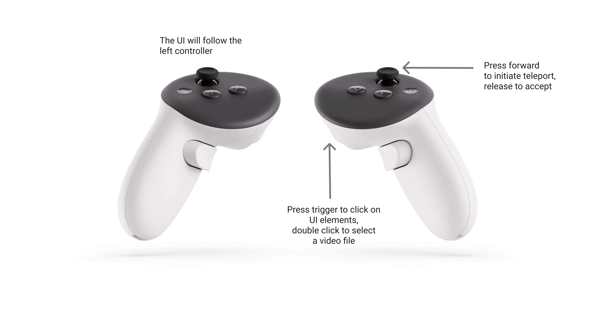

# GA VR Unity Template (ga-unity-vr-template)
G&A starter project for Meta Quest VR previz apps: URP, XR Interaction Toolkit, Normcore multiplayer, and a synced video surface.

## Project setup
* **Unity:** 6000.5.2f1
* **Unity project folder:** `GA-VR-template/`. Add that folder in Unity Hub (not the repo root).
* **Product name:** `ga-unity-vr-template`, Android ID `com.ga.ga_unity_vr_template`. Rename both in *Project Settings > Player* when starting a new project from this template.
* **Normcore:** the app key lives in `Assets/Normal/Resources/NormcoreAppSettings.asset`. Swap in a project-specific key for each new project.

## Included scenes
Carried over from the original previz and pending cleanup:
* Where Texas Became Texas
* Dawn of the Republic
* People of Texas
* The Die is Cast

## Usage
The app is built to use Oculus headsets. When running you can change what experience you are looking at through a dropdown and select a local h.264 `.mp4` file to map onto the projection/LED surface via a file browser.



### Running
There are two ways to run the app: via Quest link on a PC or as a standalone build for the Quest. Grab a corresponding zip from the repo release.

#### Run on a PC with Quest Link
* Extract the PC build on your computer
* Follow the [Meta Quest Link](https://www.meta.com/help/quest/509273027107091/) setup instructions and start the link service on your Quest Headset
* On your PC start the `ga-unity-vr-template.exe` file and wear your headset and you should be good to go

#### Run on the Quest with the Android Build
* Extract the `apk` build on to your computer
* Follow [these instructions](https://help.motive.io/space/STOR/1607696451/Installing+an+APK+using+SideQuest+Guide) to download and setup SideQuest on your PC or Mac
* Upload the `.apk` file to the Quest using SideQuest
* Upload any video files you want to test using SideQuest. Video files should be placed in the `Documents` folder
* Launch the app on your headset following the [same instructions](https://help.motive.io/space/STOR/1607696451/Installing+an+APK+using+SideQuest+Guide#Step-3:--Accessing-APK-in-Headset)

##### Get logs when running the Android build
* Connect the headset to a PC
*	```cmd
	cd C:\Users\<USER>\AppData\Roaming\SideQuest\scrcpy-win64-v2.0
	./adb.exe logcat -s Unity ActivityManager PackageManager dalvikvm DEBUG 
	```
* Run the build on the headset

## Building 
To build the Unity application, in Unity open the "build profiles" window and select whether you want to make a Windows or Android build. Then hit the "Build" button and choose a build location.
